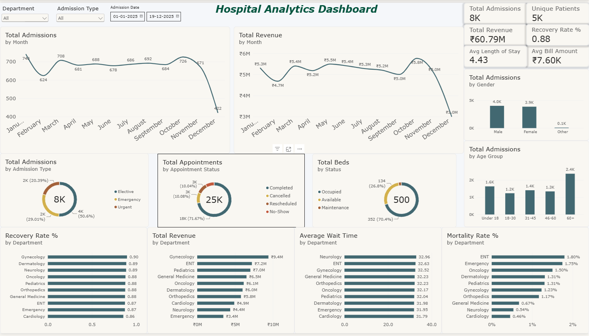

# 🏥 Hospital Analytics — End-to-End Data Analytics Project

An end-to-end **Hospital Analytics** project built to analyze hospital operations, patient activity, appointments, admissions, treatments, billing, doctors, and bed utilization.

The project follows a real-world analytics workflow using **Python, SQL Server, Power BI, and business insights**.

---

## 📌 Project Overview

Healthcare organizations generate large amounts of operational and financial data. This project transforms relational hospital data into actionable insights for management and operational decision-making.

### Key business areas covered

- Patient demographics and insurance
- Hospital admissions and discharge outcomes
- Department performance
- Appointment volume and waiting time
- Doctor activity
- Bed utilization
- Treatment and diagnosis analysis
- Billing and payment status
- Revenue trends
- Patient outcomes and recovery
- Data quality and validation

---

## 🛠️ Tools & Technologies

| Tool | Purpose |
|---|---|
| **Python / Pandas** | Data cleaning, validation & exploratory analysis |
| **SQL Server / T-SQL** | Data analysis, KPIs & advanced SQL queries |
| **Power BI** | Interactive dashboard & visualization |
| **Excel/CSV** | Source data |
| **GitHub** | Project version control & portfolio |

---

## 📂 Project Structure

```text
hospital_analytics/
│
├── data/
│   ├── admissions.csv
│   ├── appointments.csv
│   ├── beds.csv
│   ├── billing.csv
│   ├── doctors.csv
│   ├── patients.csv
│   └── treatments.csv
│
├── insights/
│   └── business_insights.md
│
├── powerbi/
│   └── Hospital_Analytics.pbix
│
├── python/
│   └── hospital_analytics.ipynb
│
├── screenshots/
│   └── hospital_dashboard.png
│
└── sql/
    ├── 01_database_setup.sql
    ├── 02_data_quality.sql
    ├── 03_admission_analysis.sql
    ├── 04_department_analysis.sql
    ├── 05_patient_analysis.sql
    └── 06_advanced_analysis.sql
```

---

## 🗃️ Dataset

The project uses seven relational CSV tables:

### Patients
Contains patient demographics, city, insurance type, and registration information.

### Doctors
Contains doctor details including department, specialization, and experience.

### Appointments
Contains appointment dates, doctors, departments, appointment status, and waiting time.

### Admissions
Contains hospital admissions, admission type, department, bed type, discharge date, and discharge status.

### Treatments
Contains diagnoses, treatment types, treatment dates, and treatment costs.

### Billing
Contains bill amount, insurance contribution, patient payment, and payment status.

### Beds
Contains bed type, department, current bed status, and linked admission information.

---

# 🔄 Analytics Workflow

```text
Raw CSV Data
     ↓
Python Data Profiling & Cleaning
     ↓
Data Quality Validation
     ↓
SQL Server Database
     ↓
SQL Analysis & KPI Queries
     ↓
Power BI Data Model
     ↓
Interactive Dashboard
     ↓
Business Insights & Recommendations
```

---

# 🐍 Python Analysis

The Python notebook performs:

- Dataset loading
- Data profiling
- Data type inspection
- Missing-value analysis
- Duplicate primary-key checks
- Categorical distribution analysis
- Numeric range validation
- Referential integrity checks
- Date validation
- Billing reconciliation
- Department consistency checks
- Data cleaning
- Final validation
- Exploratory analysis
- KPI calculation

The cleaned datasets are also prepared for downstream SQL and Power BI analysis.

---

# 🗄️ SQL Analysis

The SQL section is organized into separate scripts according to the analysis stage.

### `01_database_setup.sql`
- Creates the Hospital Analytics database
- Creates relational tables
- Adds primary/foreign keys
- Creates useful indexes
- Includes data-loading templates

### `02_data_quality.sql`
- Row-count validation
- Duplicate checks
- Referential integrity
- Invalid value checks
- Billing reconciliation
- Missing wait-time analysis
- Bed/admission consistency

### `03_admission_analysis.sql`
- Total admissions
- Unique patients
- Average length of stay
- Monthly admission trends
- Month-over-month analysis
- Admission type distribution
- Discharge outcomes
- Recovery and mortality analysis
- Age-group analysis

### `04_department_analysis.sql`
- Department admissions
- Department revenue
- Revenue per admission
- Recovery rate
- Mortality rate
- Average length of stay
- Appointment volume
- Average wait time
- Department performance ranking

### `05_patient_analysis.sql`
- Patient demographics
- Insurance analysis
- Top cities
- Appointment status
- Waiting-time analysis
- Doctor appointment volume
- Repeat/high-admission patients
- Payment status
- Insurance vs patient contribution

### `06_advanced_analysis.sql`
- Monthly revenue trends
- Month-over-month revenue
- Department revenue share
- Revenue ranking
- Repeat admissions
- Top departments
- Mortality analysis
- Appointment funnel
- Bed utilization
- Treatment and diagnosis cost analysis

---

# 📊 Power BI Dashboard

The Power BI dashboard provides a management-level view of hospital performance.

### Dashboard KPIs

- **Total Admissions:** 8,000
- **Unique Patients:** 5,479
- **Total Revenue:** ₹60.79M
- **Average Bill Amount:** ₹7.60K
- **Average Length of Stay:** 4.43 days
- **Recovery Rate:** 88.00%
- **Mortality Rate:** 1.19%
- **Total Appointments:** 25K
- **Total Beds:** 500

### Dashboard Analysis

The dashboard includes:

- Monthly Admissions Trend
- Monthly Revenue Trend
- Recovery Rate by Department
- Average Wait Time by Department
- Revenue by Department
- Mortality Rate by Department
- Admissions by Age Group
- Admissions by Gender
- Bed Status
- Appointment Status
- Admission Type

### Interactive Filters

- Department
- Admission Type
- Admission Date

---

## 📸 Dashboard Preview



---

# 💡 Key Business Insights

### 📉 December Admission Decline

Admissions decreased from **671 in November to 422 in December**, representing an approximate **37.1% month-over-month decline**.

This should be investigated alongside appointment demand, cancellations, no-shows, bed availability, and department-level trends.

### 💰 Revenue Decline

Revenue decreased from approximately **₹5.04M in November to ₹3.01M in December**, an approximate **40.3% decline**.

The slightly larger revenue decline compared with admissions makes average bill value and department/service mix important areas for investigation.

### 🏥 Department Performance

**Gynecology** recorded the highest admission volume with **1,218 admissions** and approximately **₹9.41M revenue**.

**ENT** showed comparatively strong revenue per admission at approximately **₹8.12K**.

### ❤️ Patient Outcomes

The overall recovery rate is **88.00%**, while mortality is **1.19%**.

Referred and LAMA cases should also be monitored to understand the complete discharge-outcome picture.

### 🛏️ Bed Utilization

Out of 500 beds:

- 352 are Occupied
- 134 are Available
- 14 are under Maintenance

Current overall occupancy is approximately **70.4%**.

### 📅 Appointment Operations

The hospital handled **25,000 appointments** across Completed, Cancelled, Rescheduled, and No-Show statuses.

Waiting time by department can help identify scheduling and capacity bottlenecks.

---

# 🎯 Business Recommendations

1. **Investigate the December decline** in admissions and revenue.
2. **Benchmark departments** using volume, revenue, revenue per admission, LOS, recovery, mortality, and wait time.
3. **Improve appointment efficiency** by monitoring cancellations, no-shows, rescheduling, and waiting time.
4. **Optimize bed capacity** using department- and bed-type-level utilization.
5. **Monitor collections separately from billed revenue** using pending and partially paid bills.
6. **Track patient outcomes** beyond recovery rate, including referred and LAMA cases.

---

# 🧹 Data Quality & Cleaning

During preprocessing, the following issues were evaluated:

- Missing appointment waiting times
- Missing admission references for some beds
- Duplicate primary-key checks
- Referential integrity
- Invalid numeric ranges
- Billing reconciliation
- Date consistency
- Treatment dates occurring after discharge

Because the source data is synthetic, deterministic cleaning rules were applied where required to maintain logical relationships between hospital events.

The **original CSV files are retained in the `data/` folder** for transparency and reproducibility.

---

# 📈 Project Outcomes

This project demonstrates an end-to-end analytics workflow:

**Data Cleaning → SQL → KPI Analysis → Power BI → Business Insights**

It showcases practical skills relevant to **Data Analyst / Business Analyst / BI Analyst** roles, including:

- SQL
- Data Cleaning
- Exploratory Data Analysis
- Data Validation
- KPI Development
- Power BI Dashboarding
- Business Analysis
- Data Visualization
- Healthcare Analytics
- GitHub Portfolio Development

---

## 👤 Author

**Pranay**

Built as a portfolio project demonstrating practical end-to-end data analytics and business intelligence skills.
